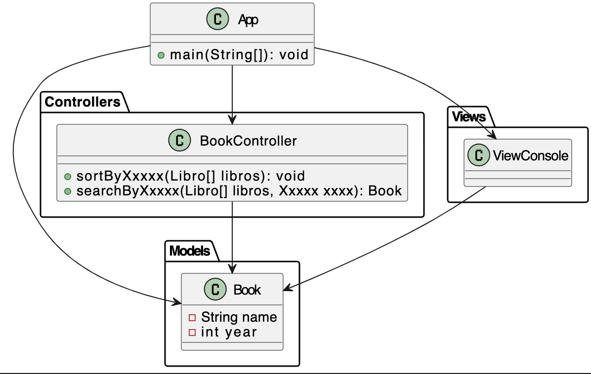

# Evaluación Unidad 1

Este repositorio contiene instrucciones para la evaluación sobre estructuras de datos en Java. El objetivo es implementar una solución usando **ordenamiento por un metodo específico** y **búsqueda binaria**, aplicados al modelo establecido, siguiendo una estructura MVC.

---

## 🧩 Estructura del Proyecto



### Explicación general de cada clase 

#### 📂 `Models/Book.java`
Clase que representa a un libro con dos atributos: `name` (nombre del libro) y `year` (año de publicación), ambos de encapsulamiento privado. Incluye constructor con todos los argurmentos, getters, setters y el método `toString()`.

#### 📂 `Controllers/LibroController.java`
Clase que contiene la lógica para ordenar libros y buscar libros; incluye:
- `sortByXxxxx(Book[] libros)`
- `searchByXxxxx(Book[] libros, Xxxxx xxxxxx)`

#### 📂 `Views/ViewConsole.java`
Clase que se encarga de mostrar mensajes y arreglos de libros en consola. Incluye métodos para imprimir mensajes generales y el arreglo de libros.

#### 📂 `App.java`
Contiene el método `main()` que ejecuta el flujo de la prueba, usando las clases anteriores. Aquí no se debe modificar el arreglo de libros, solo aplicar los métodos desarrollados.

---

## 📝 Instrucciones para la prueba FILA A

Sigue los pasos a continuación para completar el ejercicio de repaso. **No se debe modificar el arreglo predefinido de libros** en la clase `App`.

Se debe ordenar el arreglo de libros por el atributo **name** en orden **Ascendente** (de la Z a la A) con el metodo **INSERCIÓN**. Además, se debe realizar una búsqueda binaria para encontrar un libro con un nombre específico, ignorando mayúsculas y minúsculas en la comparación tanto para el ordenamietno como la busqueda.

```java
// Método para ordenar libros por nombre en orden descendente
public void sortByName(Book[] libros) {
    // Implementación pendiente
}

// Método para buscar un libro por nombre, ignorando mayúsculas y minúsculas
public Book searchByName(Book[] libros, String nombre) {
    // Implementación pendiente
    return null;
}
```

Buscar el lirbo con la primera coincidencia

- A. Imprimir el listado de elementos originales.
- B. Imprimir el listado de elementos ORDENADOS.
- C. Buscar libro con nombre `Operating System Concepts` e imprimir el resultado de la búsqueda.
- D. Buscar libro con nombre `Python the best book` e imprimir el resultado de la búsqueda.


## ✅ Rúbrica de Calificación (Total: 10 puntos)

| Criterio | Descripción | Puntaje |
|---------|-------------|---------|
| **A. Impresión original** | Se imprime correctamente el arreglo original de libros, sin alteraciones. | 1 pts. |
| **B. Ordenamiento** | El arreglo es ordenado correctamente por el atributo y orden indicado, ignorando mayúsculas/minúsculas en el caso . | 3 pts. |
| **C. Búsqueda Binaria** | Se realiza desarrollo correcto de la búsqueda binaria por su atributo ignorando mayúsculas/minúsculas en el caso de que sea string. | 4 pts. |
| **D. Resultados de busqueda esperados** | Se realiza correctamente la búsqueda binaria, y se imprime si se encuentra o no los libros por su atributo. | 2 pts. |

**Nota:** Se descontará puntaje si:
- No se utilizan los métodos requeridos (`sortByName`, `searchByName`).
- Se modifica el arreglo original de libros.
- No se usa la clase `ViewConsole` para mostrar los resultados.


## Entrega 

### 🚀 Pasos para completar la entrega

1. **Hacer fork al repositorio**  
    Ve al repositorio original y haz clic en el botón `Fork` para crear una copia en tu cuenta de GitHub.

2. **Abrir el repositorio en el espacio de la prueba en el AVAC**  
    Accede al espacio de la prueba en el AVAC y verifica que el repositorio forkeado esté vinculado correctamente.

3. **Clonar el repositorio y desarrollar la prueba**  
    Clona el repositorio forkeado en tu máquina local.
    Realiza los cambios necesarios para completar la prueba.

4. **Subir los cambios al repositorio forkeado**  
    Una vez que hayas terminado, sube los cambios al repositorio forkeado con los siguientes comandos:  
    ```bash
    git add .
    git commit -m "Finalización de la prueba"
    git push origin main
    ```

5. **Verificar la entrega**  
    Asegúrate de que los cambios estén reflejados en tu repositorio forkeado en GitHub y confirma la entrega en el AVAC.